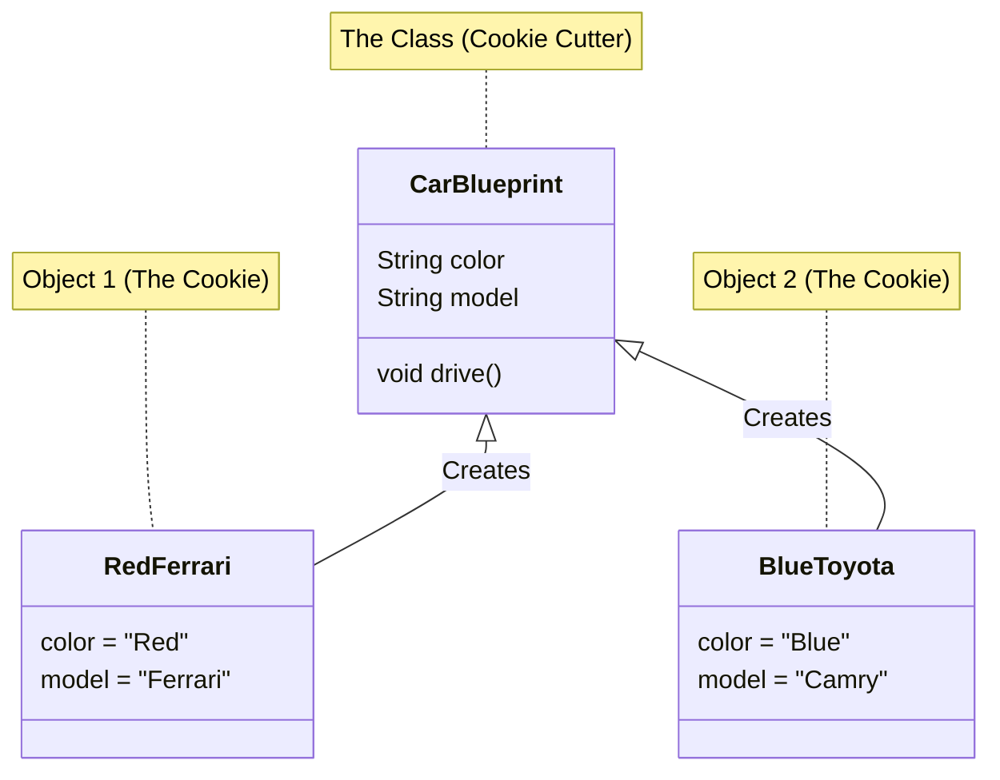

# Learn Java ☕

Welcome to the **Ultimate Java Learning Path**! This repository is categorized into difficulty levels to help you navigate your learning journey efficiently.

> [!TIP]
> Confused by a term? Check out the [GLOSSARY.md](GLOSSARY.md) for simple definitions!

## 🧠 Visual Guide: Classes vs Objects

## Curriculum Roadmap

### 🟢 01 Beginner
Start your journey here.
*   **01-fundamentals**:
    *   `VariablesAndTypes.java`: Primitives, Strings, and Type Inference.
    *   `Operators.java`: Arithmetic, Relational, and Logical operators.
    *   `ControlFlow.java`: If/Else, Switch, For/While loops.
    *   `Methods.java`: Defining and calling methods.
*   **02-oop-basics**:
    *   Classes, Objects, Inheritance, Polymorphism, Encapsulation.

### 🟡 02 Intermediate
Level up your skills.
*   **01-collections**: `List`, `Set`, `Map`, `Queue`, `ArrayList`, `HashMap`, etc.
*   **02-exceptions-io**: Try/Catch, Custom Exceptions, File Reading/Writing.
*   **03-testing**: Unit testing with JUnit.

### 🔴 03 Expert
Master advanced concepts.
*   **01-modern-features**: Lambdas, Streams, Optional, Records (Java 14+).
*   **02-concurrency**: Threads, Executors, Synchronization, CompletableFutures.
*   **03-JVM-and-reflection**: Understanding the JVM, ClassLoaders, and Reflection API.
*   **04-design-patterns** (NEW): Singleton, Factory Pattern.

### 🔵 04 Additional Topics
Real-world applications.
*   **01-database**: JDBC connectivity.
*   **02-projects**: Capstone projects (e.g., Library Management System).

## How to Use
1.  **Clone the repo**.
2.  Navigate to the folder corresponding to your skill level.
3.  Open the source files to read the comments and explanations.
4.  Run the code to see it in action!

Happy Coding!
